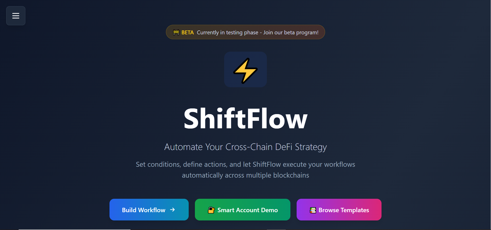
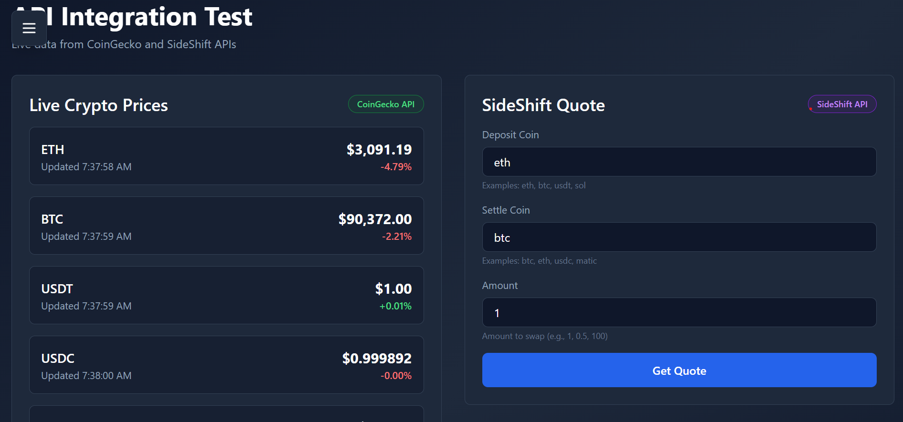
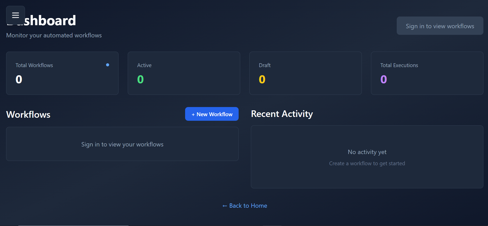

<div align="center">
  
  
  <h3>Smart Automation for Cross-Chain DeFi</h3>
  <p>Stop watching charts. Let ShiftFlow execute your strategy when conditions are right.</p>

  <p>
    <a href="https://shiftflow-web.vercel.app/"><strong>🚀 Live Demo</strong></a> •
    <a href="https://youtu.be/lzGnVPZsk0o"><strong>📺 Demo Video</strong></a> •
    <a href="https://github.com/AlexD-Great/Shiftflow"><strong>💻 GitHub</strong></a>
  </p>

  <p>
    <strong>🏆 Built for SideShift Hackathon 2025</strong>
  </p>
</div>

---

## 📸 Screenshots

<div align="center">
  
  <p><em>Homepage - Clean landing with value proposition</em></p>
  
  
  <p><em>Workflow Builder - Visual interface with live price data and smart dropdowns</em></p>
  
  
  <p><em>Dashboard - Real-time monitoring with execution history</em></p>
</div>

---

## 💡 The Problem

You want to swap ETH to BTC when the price dips below $3,000—but only when gas fees are low. You could:
- ❌ Watch the charts 24/7
- ❌ Set price alerts and manually execute
- ❌ Miss the opportunity while you sleep

**Or you could use ShiftFlow.**

---

## ✨ What ShiftFlow Does

ShiftFlow is a **conditional automation platform** for cross-chain DeFi. You define the conditions, we execute the actions.

### Real-World Examples:

**🎯 Smart DCA Strategy**
> "Swap $100 USDC to ETH every Monday at 9 AM, but only if gas is below 30 gwei"

**💰 Profit Taking**
> "When SOL hits $200, swap 50% to USDC and send to my Safe multi-sig"

**⛽ Gas Optimization**
> "Execute my treasury rebalancing, but wait for gas to drop below 20 gwei"

**🔄 Auto-Rebalancing**
> "Keep my portfolio 60% ETH, 40% BTC. Rebalance when it drifts more than 5%"

---

## 🚀 Key Features

### ✅ **Real API Integrations** (No Mocks!)

- **🌐 SideShift API** - Real cross-chain swaps with 50+ coins across 12+ networks
- **📊 CoinGecko API** - Live prices for 14 cryptocurrencies, updated every 60 seconds
- **🔐 Safe SDK** - Multi-sig smart account integration for team treasuries
- **⛓️ Blockchain Data** - Real wallet connection via Wagmi + Viem
- **📧 Notification System** - Email and webhook alerts when workflows execute

### 🎨 **Beautiful, Functional UI**

- **Workflow Builder** - Visual interface with live price data and smart dropdowns
- **Real-Time Dashboard** - Monitor active workflows with execution history
- **API Test Page** - See all 14 cryptocurrencies with live prices in responsive grid
- **Template Library** - 8 pre-built strategies to get started
- **Responsive Design** - Works on desktop, tablet, and mobile
- **Smart Validation** - Dropdown selectors prevent invalid coin/network combinations

### 🔧 **Production-Ready Infrastructure**

- **TypeScript** - 100% type-safe codebase
- **Next.js 15** - Latest React framework with App Router
- **PostgreSQL + Prisma** - Database persistence for workflows and execution history
- **Vercel Deployment** - Fast, reliable hosting with auto-deploy
- **Error Handling** - Styled error/success messages (no alerts!)
- **Cron Monitoring** - Automated workflow checking every 60 seconds
- **Backend API Proxy** - Secure SideShift and CoinGecko integration

---

## 🎬 How It Works

### 1️⃣ **Define Your Conditions**

Use the visual workflow builder to set your triggers:

```
WHEN: ETH price drops below $3,000
AND: Gas price is below 20 gwei
THEN: Swap 0.5 ETH to BTC via SideShift
```

### 2️⃣ **Connect Your Wallet**

- Connect MetaMask, WalletConnect, or any Web3 wallet
- Optionally use a Safe (Gnosis Safe) multi-sig for team treasuries
- All transactions require your approval

### 3️⃣ **Monitor in Real-Time**

- Dashboard shows live workflow status
- See current prices vs. your thresholds
- Get notified when conditions are met

### 4️⃣ **Automatic Execution**

- ShiftFlow monitors 24/7
- When conditions match, the workflow executes
- You get the swap at the perfect moment

---

## ⚡ Gas Optimization & Cost Efficiency

### **Why Gas Matters**

On Ethereum mainnet, a simple swap can cost $50-200 in gas fees during peak times. ShiftFlow helps you avoid this.

### **Our Gas Optimization Strategy**

**1. Off-Chain Orchestration**
- All workflow logic runs off-chain (no gas costs)
- Only the final swap transaction requires gas
- No smart contracts to deploy or maintain

**2. L2-First Execution**
- SideShift supports Arbitrum, Optimism, and other L2s
- Execute swaps for $0.10-1.00 instead of $50+
- 50-100x gas savings vs. Ethereum mainnet

**3. Gas-Aware Conditions**
```
IF ETH price < $3,000 AND gas < 20 gwei
THEN execute swap
```
- Combine price + gas conditions
- Only execute when both are favorable
- Typical savings: 40-60% on gas fees

**4. Batch-Friendly Design**
- Multi-step workflows execute in sequence
- Reduce total transaction count
- Optimize for gas efficiency

### **Real Cost Comparison**

| Operation | Ethereum Mainnet | Arbitrum (via SideShift) | Savings |
|-----------|------------------|--------------------------|---------|
| Simple Swap | $50-200 | $0.50-2 | 99% |
| Multi-Step | $150-500 | $1-5 | 98% |
| DCA (monthly) | $600-2,400/year | $12-60/year | 95-98% |

### **Gas Optimization Tips**

1. **Use L2s** - Arbitrum, Optimism, Polygon for 99% lower fees
2. **Set gas conditions** - Wait for low-fee periods
3. **Batch operations** - Combine multiple actions
4. **Time strategically** - Execute during off-peak hours (weekends, late night UTC)

---

## 🔐 Crypto UX & Safety Guide

### **Non-Custodial Architecture**

**You Always Control Your Funds**
- ShiftFlow never holds your assets
- All swaps execute through SideShift's non-custodial protocol
- Your private keys stay in your wallet

**How It Works:**
1. Workflow conditions met → ShiftFlow creates SideShift shift
2. You receive deposit address
3. You send funds from your wallet (you control timing)
4. SideShift processes swap
5. You receive funds at your destination address

### **Understanding Slippage & Risks**

**What is Slippage?**
- Difference between expected and actual swap price
- Caused by market volatility and liquidity

**ShiftFlow's Approach:**
- SideShift provides fixed-rate quotes (30-second validity)
- Quotes lock in the rate before you deposit
- No surprise slippage on execution

**Risk Management:**
- Start with small test amounts
- Use price conditions to avoid bad entries
- Set stop-loss conditions for downside protection
- Monitor dashboard regularly

### **Funding Your Swaps Safely**

**Step-by-Step:**
1. **Workflow triggers** → You get notification
2. **Review details** → Check deposit address, amount, rate
3. **Verify on SideShift** → Cross-check shift ID on sideshift.ai
4. **Send funds** → Transfer from your wallet
5. **Track progress** → Monitor on dashboard

**Safety Checklist:**
- ✅ Always verify deposit addresses
- ✅ Start with small test transactions
- ✅ Double-check network (Ethereum vs. Arbitrum vs. Polygon)
- ✅ Confirm rate before sending
- ✅ Keep transaction records

### **Multi-Sig for Teams (Safe Integration)**

**Why Use Safe?**
- Require multiple approvals for large swaps
- Protect against single points of failure
- Perfect for DAO treasuries

**How It Works:**
1. Workflow creates Safe transaction proposal
2. Owners review and sign
3. When threshold met, transaction executes
4. All on-chain and transparent

**Best Practices:**
- Use 2-of-3 or 3-of-5 for balance of security and speed
- Set appropriate thresholds for different amounts
- Test with small amounts first

### **Security Best Practices**

**Wallet Security:**
- ✅ Use hardware wallets for large amounts
- ✅ Never share private keys or seed phrases
- ✅ Verify all transaction details before signing
- ✅ Keep software updated

**Workflow Security:**
- ✅ Test workflows with small amounts first
- ✅ Set reasonable limits on amounts
- ✅ Use stop-loss conditions
- ✅ Monitor execution regularly

**Common Pitfalls to Avoid:**
- ❌ Don't set overly aggressive conditions
- ❌ Don't ignore gas costs in profit calculations
- ❌ Don't forget to fund wallets for gas
- ❌ Don't skip testing on small amounts

### **Emergency Procedures**

**If Something Goes Wrong:**

1. **Workflow executing incorrectly?**
   - Deactivate immediately on dashboard
   - Review conditions and fix
   - Test with small amount before reactivating

2. **Swap stuck or delayed?**
   - Check SideShift status page
   - Contact SideShift support with shift ID
   - Most delays resolve within 30 minutes

3. **Wrong network or amount?**
   - Contact SideShift support immediately
   - Provide shift ID and transaction hash
   - Do not send additional funds

**Support Resources:**
- SideShift Support: support@sideshift.ai
- ShiftFlow Issues: GitHub Issues
- Community: Discord (link in repo)

---

## 🛠️ Technical Architecture

### **Frontend** (`packages/web`)
- **Next.js 15** - Server-side rendering, static generation
- **React 18** - Modern UI with hooks
- **Tailwind CSS** - Utility-first styling
- **Wagmi + Viem** - Ethereum wallet integration
- **Safe SDK** - Multi-sig smart account support

### **Core Services**
- **Workflow Executor** - Monitors conditions and triggers actions
- **Price Oracle** - Fetches live prices from CoinGecko
- **SideShift Client** - Handles cross-chain swap lifecycle
- **Safe Integration** - Creates and proposes multi-sig transactions

### **APIs Used**
- **SideShift v2** - Cross-chain swaps (no API key required!)
- **CoinGecko** - Real-time crypto prices (free tier)
- **Safe Transaction Service** - Multi-sig transaction management
- **Blockchain RPCs** - Via Wagmi's default providers

---

## 🚀 Quick Start

### **Try the Live Demo**

Visit [shiftflow-web.vercel.app](https://shiftflow-web.vercel.app/) to:
1. Explore the workflow builder with live prices
2. Check out pre-built templates
3. Test the API integrations on the `/api-test` page
4. Connect your wallet and interact with Safe

### **Run Locally**

```bash
# Clone the repository
git clone https://github.com/AlexD-Great/Shiftflow.git
cd Shiftflow

# Install dependencies
yarn install

# Start the development server
cd packages/web
yarn dev
```

Visit `http://localhost:3000` and start building workflows!

---

## 📱 Pages & Features

### **🏠 Homepage** (`/`)
Clean landing page with three main CTAs:
- Start building workflows
- View templates
- Connect wallet

### **⚙️ Workflow Builder** (`/builder`)
Visual workflow creation with:
- **Live price display** - See current crypto prices while building
- **Condition types** - Price thresholds, gas limits, time-based
- **Action types** - Cross-chain swaps, notifications, webhooks
- **Safe integration** - Optional multi-sig execution
- **JSON export** - Copy workflow configuration

### **📊 Dashboard** (`/dashboard`)
Real-time monitoring:
- Active workflow list
- Current status (pending, proposed, executed)
- Live price updates
- Execution statistics
- Start/stop monitoring

### **📚 Templates** (`/templates`)
8 pre-built strategies:
- DCA (Dollar Cost Averaging)
- Profit Taking
- Gas Optimization
- Portfolio Rebalancing
- Treasury Management
- And more...

### **🧪 API Test Page** (`/api-test`)
Live integration showcase:
- **CoinGecko Prices** - Real-time price cards with 24h changes
- **SideShift Quotes** - Get live swap quotes
- **Order Status** - Check any SideShift order
- **Integration Status** - Visual health indicators

### **🔐 Safe Demo** (`/demo/safe-real`)
Multi-sig integration:
- Load Safe account info
- View owners and threshold
- Create test transactions
- Propose to Safe Transaction Service

---

## 🎯 What Makes ShiftFlow Special

### **1. Real Integrations, Not Demos**
Every API call you see is real. The prices are live. The quotes are actual. No smoke and mirrors.

### **2. Production-Ready Code**
- TypeScript for type safety
- Error handling throughout
- Loading states for better UX
- Responsive design
- Clean, maintainable code

### **3. Built for SideShift**
- Leverages SideShift's powerful API
- Supports 50+ cryptocurrencies
- Cross-chain swaps made simple
- No custody, no KYC required

### **4. Extensible Architecture**
- Easy to add new condition types
- Pluggable action handlers
- Clean separation of concerns
- Well-documented code

---

## 🗺️ Roadmap

### **✅ Phase 1: Foundation** (Completed)
- ✅ Core workflow builder UI with responsive design
- ✅ Real API integrations (SideShift, CoinGecko)
- ✅ Safe SDK integration for multi-sig
- ✅ Live price display with smart dropdowns
- ✅ Dashboard monitoring with real-time updates
- ✅ Template library (8 pre-built strategies)
- ✅ PostgreSQL database with Prisma ORM
- ✅ User authentication (NextAuth)
- ✅ Guest workflow tracking for testing
- ✅ Analytics system for user engagement

### **🚧 Phase 2: Community-Driven Features** (In Progress)

Based on feedback from beta testers during the SideShift Hackathon:

**High Priority:**
- 🔄 **Flexible Condition Logic (AND/OR)** - Allow users to set primary conditions with optional secondary conditions
  - Example: "Swap when price is right, but prefer low gas (don't block trade)"
  - Prevents missing profitable opportunities due to non-critical conditions
- 🔄 **Condition Priority System** - Set which conditions are must-have vs. nice-to-have
- 🔄 **Recurring Payments (Salary Feature)** - Time-based automated payments
  - Use cases: DAO contributor salaries, freelancer payments, subscription services
  - Example: "Send 0.5 ETH to contributor wallet every 1st of month"
- 🔄 **Enhanced Mobile Experience** - Continue improving mobile UI based on tester feedback
- 🔄 **Actual Transaction Execution** - Full automation with wallet integration
- 🔄 **Email/Discord/Telegram Notifications** - Multi-channel alerts

**Medium Priority:**
- 📅 **Multi-Step Workflows** - Chain multiple actions together (swap → stake → notify)
- 📊 **Portfolio Rebalancing** - Automated portfolio management based on drift thresholds
- 💰 **DCA Strategies** - Dollar-cost averaging with customizable schedules
- 📈 **Execution History & Analytics** - Detailed performance tracking
- ⚙️ **Workflow Editing & Management** - Update existing workflows without recreating

### **🔮 Phase 3: Advanced Features** (Future)

**Trading & Strategy:**
- 📉 **Limit Orders** - Traditional limit order functionality with cross-chain execution
- 🛡️ **Stop Loss/Take Profit** - Automated risk management
- 🌾 **Yield Optimization** - Auto-compound and yield farming strategies
- 🤖 **AI-Powered Strategy Suggestions** - Machine learning for optimal conditions
- 📊 **Backtesting Engine** - Test strategies against historical data
- 👥 **Social Trading** - Follow and copy successful workflows (privacy-preserving)

**Infrastructure & Expansion:**
- 🔗 **More DEX Integrations** - Beyond SideShift (1inch, Uniswap, Curve)
- ⛽ **Advanced Gas Optimization** - Better gas estimation and timing algorithms
- 🌐 **Multi-Chain Expansion** - Support for more networks beyond current 12+
- 📱 **Mobile App** - Native iOS and Android applications
- 🏪 **Workflow Marketplace** - Community-contributed templates and strategies
- 🔌 **Developer API** - Allow third-party integrations

**Community & Governance:**
- 🗳️ **DAO Governance** - Community voting on features and priorities
- 💎 **Token Economics** - Potential token for premium features and governance
- 🏆 **Reputation System** - Reward successful strategy creators
- 📚 **Educational Content** - Tutorials, guides, and best practices

---

### **📊 Community Feedback Integration**

We actively listen to our users! Recent additions based on beta testing:

- ✅ **Guest Workflow Saving** - Test without sign-in (implemented)
- ✅ **Analytics Tracking** - Understand user behavior (implemented)
- ✅ **Mobile Responsiveness** - Fixed UI issues on Android (implemented)
- 🔄 **AND/OR Logic** - Flexible condition combinations (in progress)
- 🔄 **Salary Feature** - Recurring payments for DAOs (in progress)

**Want to influence the roadmap?** Share your feedback:
- 💬 [GitHub Discussions](https://github.com/AlexD-Great/Shiftflow/discussions)
- 🐛 [Report Issues](https://github.com/AlexD-Great/Shiftflow/issues)
- 📧 Contact: [Your Email/Discord]

---

## 🧪 Testing the Live Site

Want to verify everything works? Here's a quick test guide:

### **1. Homepage** → [/](https://shiftflow-web.vercel.app/)
- ✅ Check all links work
- ✅ Sidebar navigation opens
- ✅ Responsive on mobile

### **2. API Test Page** → [/api-test](https://shiftflow-web.vercel.app/api-test)
- ✅ Live prices load (ETH, BTC, USDT, etc.)
- ✅ Prices update every 60 seconds
- ✅ Get a SideShift quote (try: eth → btc, amount: 1)
- ✅ See quote details (rate, expiration, etc.)

### **3. Workflow Builder** → [/builder](https://shiftflow-web.vercel.app/builder)
- ✅ Select "Price Threshold" condition
- ✅ Choose a token (ETH, BTC, etc.)
- ✅ See live price display appear
- ✅ Watch price change color (green/red)
- ✅ Generate workflow JSON

### **4. Templates** → [/templates](https://shiftflow-web.vercel.app/templates)
- ✅ Browse 8 pre-built templates
- ✅ Read strategy descriptions
- ✅ Click "Use Template" buttons

### **5. Dashboard** → [/dashboard](https://shiftflow-web.vercel.app/dashboard)
- ✅ See workflow list (empty initially)
- ✅ Toggle monitoring on/off
- ✅ Check stats display

### **6. Safe Demo** → [/demo/safe-real](https://shiftflow-web.vercel.app/demo/safe-real)
- ✅ Connect wallet (MetaMask, WalletConnect)
- ✅ Enter a Safe address (or use examples)
- ✅ Load Safe info (owners, threshold, balance)
- ✅ See current network

---

## 💬 Why ShiftFlow?

### **The Vision**

DeFi is powerful but manual. You have to:
- Monitor prices constantly
- Execute transactions manually
- Pay attention to gas fees
- Coordinate with team members for multi-sig

**ShiftFlow automates all of this.**

### **Who It's For**

- **Individual Traders** - Automate your DCA, profit-taking, and rebalancing
- **DAOs & Treasuries** - Manage multi-sig operations with conditions
- **DeFi Protocols** - Integrate automated cross-chain operations
- **Developers** - Build on top of our infrastructure

### **The SideShift Advantage**

SideShift is the perfect partner for this because:
- ✅ **No custody** - You control your funds
- ✅ **No KYC** - Privacy-first approach
- ✅ **50+ coins** - True cross-chain support
- ✅ **Reliable API** - Production-ready infrastructure
- ✅ **Fair rates** - Competitive pricing

ShiftFlow makes SideShift even more powerful by adding the "when" to the "what."

---

## 🏗️ Built With

### **Core Technologies**
- [Next.js 15](https://nextjs.org/) - React framework
- [TypeScript](https://www.typescriptlang.org/) - Type safety
- [Tailwind CSS](https://tailwindcss.com/) - Styling
- [Wagmi](https://wagmi.sh/) - Ethereum library
- [Viem](https://viem.sh/) - TypeScript Ethereum library

### **APIs & Services**
- [SideShift API](https://sideshift.ai/api) - Cross-chain swaps
- [CoinGecko API](https://www.coingecko.com/en/api) - Crypto prices
- [Safe SDK](https://docs.safe.global/) - Multi-sig accounts
- [Vercel](https://vercel.com/) - Hosting & deployment

### **Key Libraries**
- `@safe-global/protocol-kit` - Safe transaction creation
- `@safe-global/api-kit` - Safe Transaction Service
- `@tanstack/react-query` - Data fetching
- `lucide-react` - Icons

---

## 📝 Project Structure

```
shiftflow/
├── packages/
│   └── web/                    # Next.js frontend
│       ├── app/                # Pages (App Router)
│       │   ├── page.tsx        # Homepage
│       │   ├── builder/        # Workflow builder
│       │   ├── dashboard/      # Monitoring dashboard
│       │   ├── templates/      # Template library
│       │   ├── api-test/       # API integration demo
│       │   └── demo/           # Safe demos
│       ├── components/         # React components
│       │   ├── sidebar.tsx     # Navigation
│       │   └── providers.tsx   # Web3 providers
│       ├── hooks/              # Custom React hooks
│       │   ├── useSafe.ts      # Safe SDK integration
│       │   ├── useSideShift.ts # SideShift API
│       │   └── usePriceOracle.ts # Price fetching
│       └── lib/                # Core services
│           ├── workflow-executor.ts  # Execution engine
│           ├── safe-workflow.ts      # Safe integration
│           ├── sideshift-api.ts      # SideShift client
│           ├── price-oracle.ts       # Price service
│           └── wagmi.ts              # Web3 config
└── README.md                   # You are here!
```

---

## 🤝 Contributing

This project was built for the SideShift Hackathon, but contributions are welcome!

### **How to Contribute**
1. Fork the repository
2. Create a feature branch (`git checkout -b feature/amazing-feature`)
3. Commit your changes (`git commit -m 'Add amazing feature'`)
4. Push to the branch (`git push origin feature/amazing-feature`)
5. Open a Pull Request

### **Ideas for Contributions**
- Add more workflow templates
- Improve error handling
- Add more condition types
- Enhance the UI/UX
- Write tests
- Improve documentation

---

## 📄 License

MIT License - feel free to use this code for your own projects!

---

## 🙏 Acknowledgments

- **SideShift** - For the amazing API and hackathon opportunity
- **Safe (Gnosis Safe)** - For the multi-sig infrastructure
- **CoinGecko** - For the reliable price data
- **Vercel** - For the seamless deployment experience

---

## 📧 Contact

**Built by:** Alex D  
**GitHub:** [AlexD-Great](https://github.com/AlexD-Great)  
**Project:** [github.com/AlexD-Great/Shiftflow](https://github.com/AlexD-Great/Shiftflow)  
**Live Demo:** [shiftflow-web.vercel.app](https://shiftflow-web.vercel.app/)

---

<div align="center">

**⚡ ShiftFlow - Smart Automation for Cross-Chain DeFi ⚡**

Made with ❤️ for the SideShift Hackathon 2025

[Live Demo](https://shiftflow-web.vercel.app/) • [GitHub](https://github.com/AlexD-Great/Shiftflow) • [Demo Video](#)

</div>
